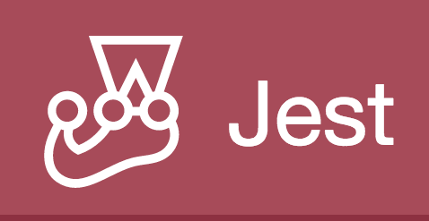

<h2>Documentação</h2>

Jest é um poderoso Framework de Testes em JavaScript com um foco na simplicidade.

Funciona com projetos usando: Babel, TypeScript, Node, React, Angular, Vue e muito mais!

Jest é um framework de teste em JavaScript projetado para garantir a correção de qualquer código JavaScript. Ele permite que você escreva testes com uma API acessível, familiar e rica em recursos que lhe dá resultados rapidamente.

Jest está bem documentado, requer pouca configuração e pode ser estendido para corresponder aos seus requisitos.

Jest torna os testes agradáveis.

<strong>Acesso à documentação (inglês):</strong> <a href="https://jestjs.io/pt-BR/docs/getting-started">https://jestjs.io/pt-BR/docs/getting-started</a>

<ul>
  <strong>Introdução</strong>ong>
  <ul>
    <li>Iniciando</li>
    <li>Usando Matchers</li>
    <li>Testando Código Assíncrono</li>
    <li>Configuração e Desmontagem</li>
    <li>Funções de Simulação</li>
    <li>Plataforma Jest</li>
    <li>Jest Community</li>
    <li>Mais Recursos</li>
  </ul>
</ul>

<ul>
  <strong>Guias</strong>
  <ul>
    <li>Teste de Snapshot</li>
    <li>Um Exemplo de Async</li>
    <li>Simulações de Temporizador</li>
    <li>Simulações Manuais</li>
    <li>Simulação de Classes ES6</li>
    <li>Passando pelo módulo de mock</li>
    <li>Módulos ECMAScript</li>
    <li>Usando com webpack</li>
    <li>Using with puppeteer</li>
    <li>Using with MongoDB</li>
    <li>Using with DynamoDB</li>
    <li>Manipulação DOM</li>
    <li>Watch Plugins</li>
    <li>Migrando para o Jest</li>
    <li>Resolução de Problemas</li>
    <li>Arquitetura</li>
  </ul>
</ul>

<ul>
  <strong>Guias para frameworks</strong>
  <ul>
    <li>Testando Apps React</li>
    <li>Testando Apps React Native</li>
    <li>Testing Web Frameworks</li>
  </ul>
</ul>

<ul>
  <strong>Guias de atualização</strong>
  <ul>
    <li>From v28 to v29</li>
  </ul>
</ul>

<h3>Tempo Estudando a documentação</h3>

  

<h4><b>Status da documentação:</b> :speech_balloon: Estudando</h4>
